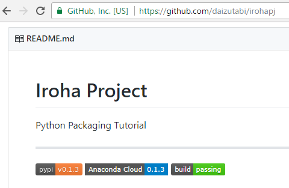

# Anaconda.orgへのアップロード

いよいよ最後のタスクである．`iroha`パッケージをAnaconda Cloudで公開する． [Building conda packages with conda skeleton](https://conda.io/docs/user-guide/tutorials/build-pkgs-skeleton.html)を参照して一歩ずつ進めていこう．

## condaパッケージの作成

condaパッケージを作成するために必要な`conda-build`パッケージは，ルート環境下にしかインストールできない．同時に`m2-patch`もインストールする．

```bash
> activate root
(root) > conda install m2-patch conda-build
```

パッケージを作成したいディレクトリに移動して，以下を実行する．

```bash
(root) > conda skeleton pypi iroha
```

!!! Note
    そのディレクトリにすでに`iroha`ディレクトリがあるとエラーが発生する．


!!! Note
    実行の最後で「アクセスが拒否されました。」というメッセージが表示される場合があるが，ビルド自体はうまくいっている．

`iroha`ディレクトリが作成されて，その下に`meya.yml`ファイルが格納された．次に２つの実行ファイルをダウンロードして同じディレクトリ下に保存する．

* [`build.sh`](https://conda.io/docs/_downloads/build1.sh)
* [`bld.bat`](https://conda.io/docs/_downloads/bld.bat)

!!! Note
    `build.sh`，`bld.bat`は必要なくなったようだ．

パッケージをビルドする．

```bash
(root) > conda-build iroha
```

Windowsの場合，

```
C:\Users\daizu\Miniconda3\conda-bld\win-64\iroha-0.1.3-py36_0.tar.bz2
```

が作成される．

## ローカルにインストール

`--use-local`フラッグを指定して`iroha`パッケージをインストールする．

```bash
(root) > conda create -n conda-iroha
(root) > activate conda-iroha
(conda-iroha) > conda install --use-local iroha
```

依存パッケージ`click`とともに`iroha`パッケージがインストールされた．

```bash
(conda-iroha) > conda list
certifi                   2017.11.5        py36hb8ac631_0
click                     6.7              py36hec8c647_0
iroha                     0.1.3                    py36_0    local
pip                       9.0.1            py36h226ae91_4
python                    3.6.3                h3b118a2_4
setuptools                36.5.0           py36h65f9e6e_0
vc                        14                   h2379b0c_2
vs2015_runtime            14.0.25123           hd4c4e62_2
wheel                     0.30.0           py36h6c3ec14_1
wincertstore              0.2              py36h7fe50ca_0
```

## オプションのステップ

* [Optional—Building for a different Python version]( https://conda.io/docs/user-guide/tutorials/build-pkgs-skeleton.html#optional-building-for-a-different-python-version)

* [Optional—Converting conda package for other platforms](https://conda.io/docs/user-guide/tutorials/build-pkgs-skeleton.html#optional-converting-conda-package-for-other-platforms)

## Anaconda.orgへのアップロード

1. まだであれば，[Anaconda.org](https://anaconda.org)でアカウントを作成する
1. `(root) > conda install anaconda-client`
1. `(root) > anaconda login`でユーザー名とパスワードを入力する．


先ほど作ったパッケージをアップロードする．

```bash
(root) > anaconda upload C:\Users\daizu\Miniconda3\conda-bld\win-64\iroha-0.1.3-py36_0.tar.bz2
```

[Anaconda.org](https://anaconda.org)にアクセスすると，`iroha`パッケージの表示が見つかるはずである．


!!! Note
    ビルド成功時に同時にアップロードを行うためには，`conda config --set anaconda_upload yes`を実行する．

Anaconda.org経由でインストールしてみる．`daizutabi`チャネルを使う．

```bash
(root) conda remove -n conda-iroha --all
(root) conda clean --all
(root) > conda create -n conda-iroha
(root) > activate conda-iroha
(conda-iroha) > conda install -c daizutabi iroha
(conda-iroha) > conda list
certifi                   2017.11.5        py36hb8ac631_0
click                     6.7              py36hec8c647_0
iroha                     0.1.3                    py36_0    daizutabi
pip                       9.0.1            py36h226ae91_4
python                    3.6.3                h3b118a2_4
setuptools                36.5.0           py36h65f9e6e_0
vc                        14                   h2379b0c_2
vs2015_runtime            14.0.25123           hd4c4e62_2
wheel                     0.30.0           py36h6c3ec14_1
wincertstore              0.2              py36h7fe50ca_0
```


## バッジの追加

Anaconda.orgにパッケージを登録したことを示すバッジを`README.md`につける． `README.md`に記述を追加して以下のようになった．

```markdown
# Iroha Project

Python Packaging Tutorial

---

[![PyPI Version][pypi-v-image]][pypi-v-link]
[![Anaconda Version][anaconda-v-image]][anaconda-v-link]
[![Build Status][travis-image]][travis-link]

[pypi-v-image]: https://img.shields.io/pypi/v/iroha.png
[pypi-v-link]: https://pypi.python.org/pypi/iroha
[anaconda-v-image]: https://anaconda.org/daizutabi/iroha/badges/version.svg
[anaconda-v-link]: https://anaconda.org/daizutabi/iroha
[travis-image]: https://travis-ci.org/daizutabi/iroha.svg?branch=master
[travis-link]: https://travis-ci.org/daizutabi/iroha
```

`git push`後に[レポジトリのページ](https://github.com/daizutabi/iroha)を確認するとバッジが表示されている．


